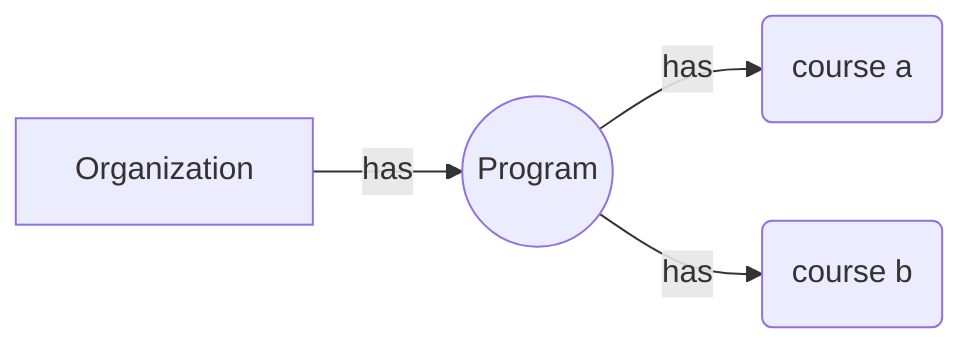

# Open Education API Implementation Quickstart
 

## Getting started

This project provides the OEAPI/OOAPI infrastructure (the Endpoint itself) and guides you on how to load your own data. 
The Open Education API is known in Dutch as the “Open Onderwijs API” (OOAPI), which is why the term “OOAPI” is sometimes also used throughout this implementation.

We recommend that you take at least a quick look at the [Open Education API](https://openonderwijsapi.nl/#/) specification to familiarize yourself with the basic concepts of OEAPI/OOAPI and its purpose. 
This implementation is based on version 5 of the Open Education API specification (https://openonderwijsapi.nl/specification/v5/docs.html
).

## Installing the OEAPI EndPoint

Installing the EndPoint could be done in two ways; as a docker component or compiling sources and running it as a jar.

### The easy way with Docker

The easiest way to install it is deploying it in docker container.

It is as simple as this:

```bash

# git clone git@github.com/open-education-api/oeapi-endpoint-quickstart.git

git clone https://github.com/open-education-api/oeapi-endpoint-quickstart.git

cd oeapi-endpoint-quickstart

docker compose up

# Depending on your platform the command could be "docker-compose up"

```
(The application might restart several times at startup waiting to MySQL to be up)

Using the default configuration the service is accesible at http://localhost:57075

To customize different parameters have a look at

- src/main/resources/application.properties

- docker-compose.yml

File src/main/resources/application.properties comes with default values to get started. There you can customize the options for your organization.

### Docker with devel version of OEAPI

If you want to test the latest updates, you may prefer to try the development version of the app. In that case, the steps would be:

```bash

# git clone -b devel git@github.com/open-education-api/oeapi-endpoint-quickstart.git

git clone -b devel https://github.com/open-education-api/oeapi-endpoint-quickstart.git

cd oeapi-endpoint-quickstart 

docker compose up

# Depending on your platform the command could be "docker-compose up"

```
(The application might restart several times at startup waiting to MySQL to be up)

Please note that this is a development version, not intended for production use. It may be unstable, inconsistent, or incomplete

### Running it as a jar

In this case, you should build the JAR file from the source code using the IDE of your choice (e.g., NetBeans, Eclipse, etc.) or on the command line.

Before building the JAR, make sure to review the file located at _src/main/resources/application.properties_ and configure the datasource settings to point to your desired DBMS.

Building using the command line goes as follows:

```sh
mvn package
```

If the above fails with the following error:

```
[ERROR] Error executing Maven.
[ERROR] java.lang.IllegalStateException: Unable to load cache item
[ERROR] Caused by: Unable to load cache item
[ERROR] Caused by: Could not initialize class net.sf.cglib.core.MethodWrapper
[ERROR] Caused by: Exception net.sf.cglib.core.CodeGenerationException: java.lang.reflect.InaccessibleObjectException-->Unable to make protected final java.lang.Class java.lang.ClassLoader.defineClass(java.lang.String,byte[],int,int,java.security.ProtectionDomain) throws java.lang.ClassFormatError accessible: module java.base does not "opens java.lang" to unnamed module @13a5fe33 [in thread "main"]
```

add the following environment variable and try again:

```sh
export JDK_JAVA_OPTIONS='--add-opens java.base/java.lang=ALL-UNNAMED --enable-native-access=ALL-UNNAMED'
```

Once you've built the JAR file, and assuming your Java environment is properly set up, you can start the application with the following command (note that the JAR file name may vary):

```bash

nohup java -jar oeapi-qs.jar &

# (if jar is tagged with version, change accordingly)
```

More details can be found here ["Installing the Quickstart as a Microservice Using the JAR File (Without Docker)"](docs/quickstart_as_microservice_using_jar.md)


## Database Backend

#### When deployed as a docker component

If deployed in a Docker container, the setup will handle everything for you. It will start a MySQL server and automatically create all the necessary tables.

#### When deployed manually

Alternatively, if you prefer to deploy the application manually and run it as a JAR file, you need to configure the database connection parameters before building it. Specify the DBMS and database details in `src/main/resources/application.properties`. The application will then create all the necessary tables the first time it starts.

  

## Entering data?

The data is meant to be dealt using JSONs. This endpoint is designed to be used and mantained without the need of knowing the internals of the database backend (unless you want to) If you do not want to 'talk' JSON with your Endpoint, you can feed it using HTML Forms, using a CMS, etc.  You could find more instructions later in this page.


## Security

In this implementation, the OEAPI endpoint can be updated using REST calls (e.g., by sending a JSON object via POST or PUT). This greatly simplifies adding or removing a course, as there’s no need to understand the internal database structure used by OEAPI or how to update it directly.
To prevent unwanted or unauthorized updates, the endpoint must be secured. This is relatively easy to do and can be implemented in two ways—or ideally, by combining both:
  
 ### By network configuration
This involves restricting the IP addresses or subnets that can access the endpoint and/or its update methods (POST, PUT, etc.). This is typically done using Apache or Nginx rules, but it can also be achieved through firewall settings.

It should be place behind a reverse proxy which limits the HTTP methods to GET otherwise anyone could perform uploads.

Sample nginx configuration:

  

```bash

...

location / {

limit_except GET {

allow 127.0.0.1;

deny all;

}

proxy_pass http://your_oeapi_url;

}

...

```

 ### By using the endpoint’s built-in security features
The endpoint can be configured to allow access only to specific users, ensuring that only authorized individuals can perform update operations.  In short, you can enable this by setting a property in the application.properties file  (see https://openproject.univ-unita.eu/projects/unita-it-team/wiki/2-dot-7-1-security )  The security mechanism is based on JWT (JSON Web Tokens).

Once this option is enabled, you will be required to log in to access the update options through the endpoint’s small dashboard, or to authenticate before performing POST, PUT, and similar requests via REST.


## Loading your own institutional data

  

### Overview for the impatient

The best way to understand how it works and learn what is required to load your data is to perform a small test with simple data.

Before proceeding, it’s important to note that certain relationships must exist among the data you load.

The most fundamental relationship is that a course must belong to a program (e.g., degree, master’s program), and a program should belong to an organization (e.g., university, learning center).
  



At src/main/resources you can find a sample JSONs of them for you try. The order you should follow is:
  
1. Load the organization
```bash

curl -v -H "Content-Type: application/json" -d @src/main/resources/1-Organization.json http://localhost:57075/organizations

```
2. Load the program
```bash

curl -v -H "Content-Type: application/json" -d @src/main/resources/2-Program.json http://localhost:57075/programs

```
3. Load the course

```bash

curl -v -H "Content-Type: application/json" -d @src/main/resources/3-Course.json http://localhost:57075/courses

```

4. Load the course offering

```bash

curl -v -H "Content-Type: application/json" -d @src/main/resources/4-Offering.json http://localhost:57075/offerings

```
   
# How to load your own data in detail
    
In short, the OEAPI specification only defines how to retrieve data from the endpoint. It is up to each adopter of the specification to decide how the endpoint gathers course information. However, in this implementation, we’ve chosen to extend its functionality to make it easier for you to provide your data to the endpoint.

There are several possible ways for the endpoint to access course data:


###  1. Manually sending a JSON

The mininal (manual) way of putting a course in the OEAPI endpoint is doing a POST request to /courses with the course in json format. It can be done with any tool that makes REST request. It can POSTMAN, HTTPIE, etc. HTTPIE ( [https://httpie.io/](https://httpie.io/) ) is a good option if you want to use it locally without interacting with an external service in the cloud
  
### 2. Using a CMS or a Form  

It is not complicated to create a form like the image below that push a course to your OEAPI endpoint. It can be ported or used in any CMS of your taste


```html

<!DOCTYPE html>
<html lang="en">
<head>
    <meta charset="UTF-8">
    <meta name="viewport" content="width=device-width, initial-scale=1">
    <title>Course Submission Form</title>
    <link rel="stylesheet" href="https://cdn.jsdelivr.net/npm/bootstrap@5.3.0/dist/css/bootstrap.min.css">
</head>
<body class="container mt-5">
    <h2 class="mb-4">Submit a New Course</h2>
    <form id="courseForm" class="needs-validation" novalidate>
        <div class="mb-3">
            <label class="form-label">Course Code</label>
            <input type="text" id="code" class="form-control" required>
        </div>
        <div class="mb-3">
            <label class="form-label">Course Name</label>
            <input type="text" id="name" class="form-control" required>
        </div>
        <div class="mb-3">
            <label class="form-label">Description</label>
            <textarea id="description" class="form-control" rows="3" required></textarea>
        </div>
        <div class="mb-3">
            <label class="form-label">Abbreviation</label>
            <input type="text" id="abbreviation" class="form-control" required>
        </div>
        <div class="mb-3">
            <label class="form-label">Teaching Language (3 characters, ISO 639-2)</label>
            <input type="text" id="language" class="form-control" required>
        </div>
        <div class="mb-3">
            <label class="form-label">Level</label>
            <select id="level" class="form-select" required>
                <option value="bachelor">Bachelor</option>
                <option value="master">Master</option>
            </select>
        </div>
        <button type="submit" class="btn btn-primary">Submit</button>
    </form>
    
    <div id="message" class="mt-3"></div>
    
    <script>
        document.getElementById('courseForm').addEventListener('submit', async function(event) {
            event.preventDefault();
            
            const courseData = {
                primaryCode: {
                    codeType: "identifier",
                    code: document.getElementById('code').value
                },
                name: [{ language: "en-GB", value: document.getElementById('name').value }],
                description: [{ language: "en-GB", value: document.getElementById('description').value }],
                abbreviation: document.getElementById('abbreviation').value,
                teachingLanguage: document.getElementById('language').value,
                level: document.getElementById('level').value
            };
            
            try {
                const response = await fetch('http://localhost:57075/courses', {
                    method: 'POST',
                    headers: { 'Content-Type': 'application/json' },
                    body: JSON.stringify(courseData)
                });
                
                if (response.ok) {
                    document.getElementById('message').innerHTML = '<div class="alert alert-success">Course submitted successfully!</div>';
                    document.getElementById('courseForm').reset();
                } else {
                    document.getElementById('message').innerHTML = '<div class="alert alert-danger">Failed to submit course.</div>';
                }
            } catch (error) {
                document.getElementById('message').innerHTML = '<div class="alert alert-danger">Error: ' + error.message + '</div>';
            }
        });
    </script>
</body>
</html>
```

### 3. Automated data retrieval from the university's academic management system.  

 Course data is read directly from the institutional ERP and sent in JSON format to the OEAPI.

### 4. Using the tiny dashboard of the endpoint
The endpoint has a tiny dashboard that allows to put any course directly to your endpoint ( http://your-endpoint-url/oeapi-td.html )

### 5. Other approaches

Any other methods, depending on institutional needs

#### Which option would be used or is the best choice? Probably, it would be a mix.

For degrees and master's programs, the most likely way would be using option 3. However, for less formal courses—such as BIPs, microcredentials, and similar programs—a form-based frontend (within a CMS or similar system) would probably be more suitable.  
  
Regardless of the approach, all options ultimately come down to one simple action: sending a standardized JSON to your OEAPI. This allows us to share our tools for loading courses with other universities, even if we don't have the same infrastructure (servers, databases, etc.).

# How to see what your Endpoint holds

The "right way" should be using a tool for testing APIs like HTTPie, Postman, etc. and follow the spec to interact with it.

Also, for seeing and checking the data in your OEAPI a tiny frontend is included (not for production!)  You can reach it at http://localhost:57075/oeapi-td.html


# Configuration

The following environment variables can be use to change the behavior of this application:

- `SERVER_PORT`

  HTTP port the application is served on.  Default value:  57075.

- `SPRING_DATASOURCE_URL`

  JDBC URL to the database.

- `SPRING_DATASOURCE_DRIVER_CLASS_NAME`

  Class name of JDBC driver.   Default value: `com.mysql.cj.jdbc.Driver`), make sure to add the dependency to the [pom.xml file](./pom.xml) when changing this.

- `SPRING_DATASOURCE_USERNAME`

  Database user name.

- `SPRING_DATASOURCE_PASSWORD`

  Database user password.

Note: all defaults (and more properties) are defined in [application.properties](./src/main/resources/application.properties).

# Development

## Running tests

The test suite needs a database to run.  Use the following docker invocation to start MySQL or us another method.

```sh
docker run -p 3306:3306 \
    -e MYSQL_ROOT_PASSWORD=x \
    -e MYSQL_DATABASE=oeapi_qs \
    -e MYSQL_USER=oeapi_qs \
    -e MYSQL_PASSWORD=oeapi_qs \
    docker.io/mysql
```

The tests are skipped by default and we need to override the configured datasource URL:

```sh
mvn \
    -DskipTests=false \
    -Dspring.datasource.url='jdbc:mysql://localhost/oeapi_qs' \
    test
```

As described in [Running it as a jar](#running-it-as-a-jar) you'll probably need the following to run the tests:

```sh
export JDK_JAVA_OPTIONS='--add-opens java.base/java.lang=ALL-UNNAMED --enable-native-access=ALL-UNNAMED'
```

# Other

## Additional API calls intended to support the frontend (not part of the specification)

The quickstart includes several API calls designed to support frontend development. Most of these calls are intended to provide the frontend with valid or allowed values for certain enumerations (such as mode of delivery, fields of study, etc.).

This approach allows frontend selectors to be populated dynamically with values provided by the endpoint, rather than hard-coding them in the frontend itself. It also simplifies maintenance, since values can be added, corrected, or updated on the backend without requiring frontend changes.

Detailed info can be found [here](docs/additional_apis.md)
